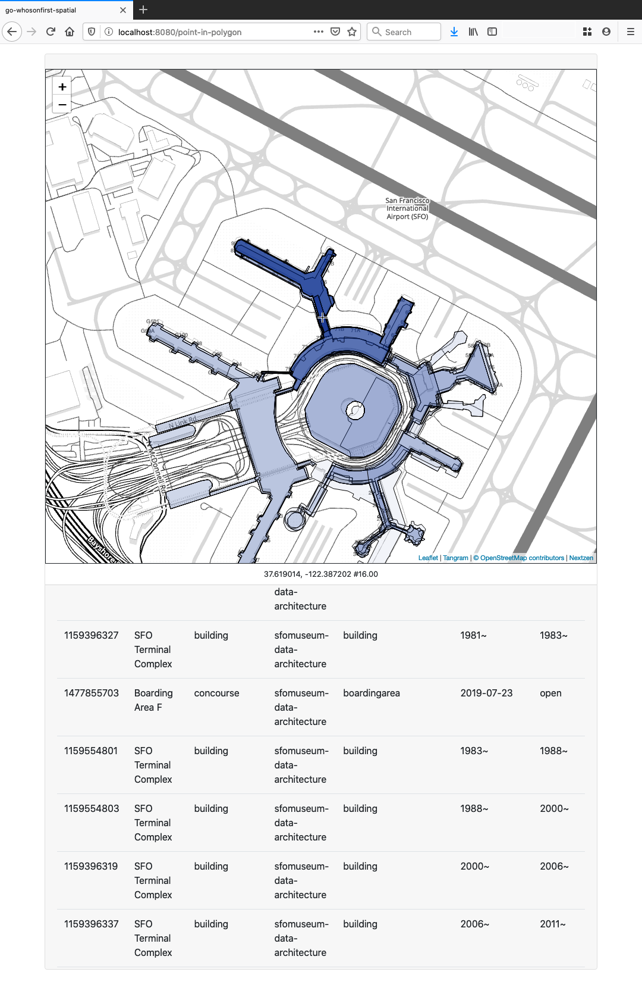

# go-whosonfirst-spatial-http



## IMPORTANT

This is work in progress. It works... until it doesn't. It is not documented.

## Tools

### server

```
$> bin/server -h
  -custom-placetypes string
    	...
  -custom-placetypes-source string
    	...
  -data-endpoint string
    	... (default "https://data.whosonfirst.org")
  -enable-candidates
    	Enable the /candidates endpoint to return candidate bounding boxes (as GeoJSON) for requests.
  -enable-custom-placetypes
    	...
  -enable-geojson
    	Allow users to request GeoJSON FeatureCollection formatted responses.
  -enable-properties
    	Enable support for 'properties' parameters in queries.
  -enable-www
    	Enable the interactive /debug endpoint to query points and display results.
  -exclude value
    	Exclude (WOF) records based on their existential flags. Valid options are: ceased, deprecated, not-current, superseded.
  -host string
    	The hostname to listen for requests on. (default "localhost")
  -initial-latitude float
    	... (default 37.616906)
  -initial-longitude float
    	... (default -122.386665)
  -initial-zoom int
    	... (default 13)
  -is-wof
    	Input data is WOF-flavoured GeoJSON. (Pass a value of '0' or 'false' if you need to index non-WOF documents. (default true)
  -mode string
    	Valid modes are: directory, featurecollection, file, filelist, geojsonl, repo, spatialite. (default "files")
  -nextzen-apikey string
    	A valid Nextzen API key
  -nextzen-style-url string
    	... (default "/tangram/refill-style.zip")
  -nextzen-tile-url string
    	... (default "https://{s}.tile.nextzen.org/tilezen/vector/v1/512/all/{z}/{x}/{y}.mvt")
  -port int
    	The port number to listen for requests on. (default 8080)
  -properties-reader-uri string
    	...
  -setenv
    	Set flags from environment variables.
  -spatial-database-uri string
    	Valid options are: rtree:// (default "rtree://")
  -static-prefix string
    	Prepend this prefix to URLs for static assets.
  -strict
    	Be strict about flags and fail if any are missing or deprecated flags are used.
  -templates string
    	An optional string for local templates. This is anything that can be read by the 'templates.ParseGlob' method.
  -verbose
    	Be chatty.
  -www-path string
    	The URL path for the interactive debug endpoint. (default "/debug")
```

For example:

```
$> git clone https://github.com/whosonfirst-data/whosonfirst-data-admin-cn.git /usr/local/data/whosonfirst-data-admin-cn
```

And then:

```
$> go run -mod vendor cmd/server/main.go \
	-spatial-database-uri 'rtree:///?strict=false' \
	-mode directory://
	/usr/local/data/whosonfirst-data-admin-cn/data

...time passes...
13:58:09.864528 [main] STATUS indexing 679793 records indexed
13:58:10.874143 [main] STATUS indexing 679877 records indexed
13:58:11.875543 [main] STATUS indexing 679965 records indexed
13:58:12.670963 [main] STATUS finished indexing in 1h17m0.812868967s
```

See the way it took an hour and seventeen minutes to index 680, 000 records? That's not great, it just _is_ right now.

And then:

```
$> curl 'http://localhost:8080/api/point-in-polygon?latitude=39.509167&longitude=116.410556'
{
  "places": [
    {
      "wof:id": 890516977,
      "wof:parent_id": 85669797,
      "wof:name": "Langfang",
      "wof:placetype": "county",
      "wof:country": "CN",
      "wof:repo": "whosonfirst-data-admin-cn",
      "wof:path": "890/516/977/890516977.geojson",
      "wof:superseded_by": [],
      "wof:supersedes": [],
      "mz:uri": "https://data.whosonfirst.org/890/516/977/890516977.geojson",
      "mz:latitude": 39.195182,
      "mz:longitude": 116.53908,
      "mz:min_latitude": 38.4723710693954,
      "mz:min_longitude": 116.1113275467743,
      "mz:max_latitude": 40.09282896263684,
      "mz:max_longitude": 117.25007014314785,
      "mz:is_current": 1,
      "mz:is_ceased": -1,
      "mz:is_deprecated": 0,
      "mz:is_superseded": 0,
      "mz:is_superseding": 0,
      "wof:lastmodified": 1582376717
    },
    {
      "wof:id": 85669797,
      "wof:parent_id": 85632695,
      "wof:name": "Hebei",
      "wof:placetype": "region",
      "wof:country": "CN",
      "wof:repo": "whosonfirst-data-admin-cn",
      "wof:path": "856/697/97/85669797.geojson",
      "wof:superseded_by": [],
      "wof:supersedes": [],
      "mz:uri": "https://data.whosonfirst.org/856/697/97/85669797.geojson",
      "mz:latitude": 38.327924,
      "mz:longitude": 115.282382,
      "mz:min_latitude": 36.047962,
      "mz:min_longitude": 113.458183,
      "mz:max_latitude": 42.611728,
      "mz:max_longitude": 119.847038,
      "mz:is_current": 1,
      "mz:is_ceased": -1,
      "mz:is_deprecated": 0,
      "mz:is_superseded": 0,
      "mz:is_superseding": 0,
      "wof:lastmodified": 1587428610
    },
    {
      "wof:id": 85632695,
      "wof:parent_id": 102191569,
      "wof:name": "China",
      "wof:placetype": "country",
      "wof:country": "CN",
      "wof:repo": "whosonfirst-data-admin-cn",
      "wof:path": "856/326/95/85632695.geojson",
      "wof:superseded_by": [],
      "wof:supersedes": [],
      "mz:uri": "https://data.whosonfirst.org/856/326/95/85632695.geojson",
      "mz:latitude": 32.529718,
      "mz:longitude": 106.802874,
      "mz:min_latitude": 20.226223,
      "mz:min_longitude": 73.499414,
      "mz:max_latitude": 53.560974,
      "mz:max_longitude": 134.77281,
      "mz:is_current": 1,
      "mz:is_ceased": -1,
      "mz:is_deprecated": 0,
      "mz:is_superseded": 0,
      "mz:is_superseding": 0,
      "wof:lastmodified": 1587428633
    }
  ]
}
```

## See also

* https://github.com/whosonfirst/go-whosonfirst-spatial