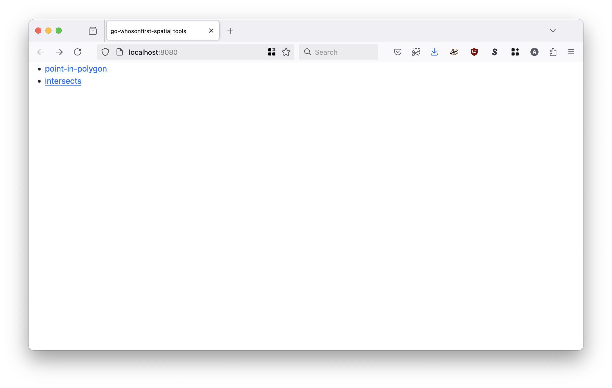
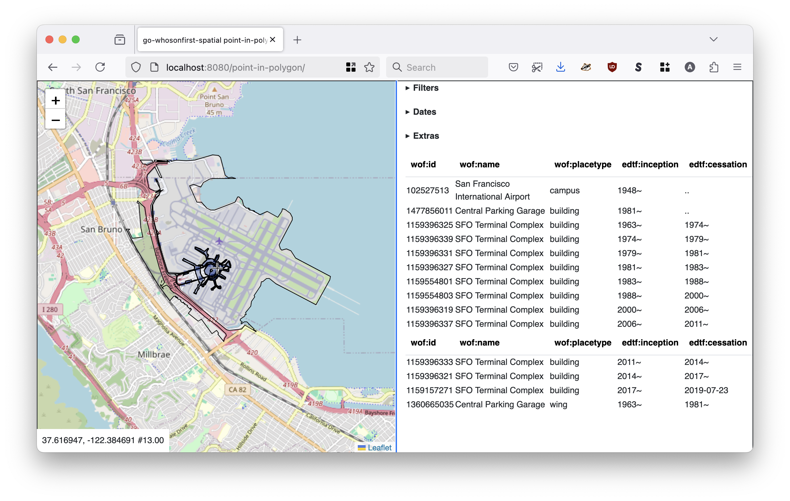
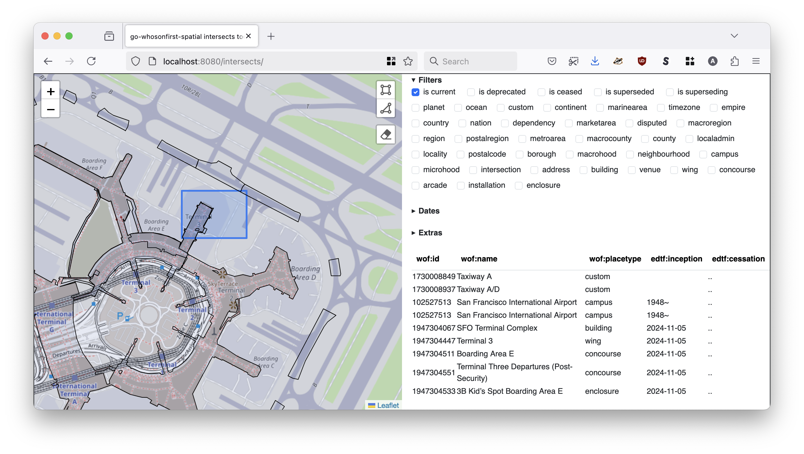

# server


```
$> ./bin/server -h
  -authenticator-uri string
    	A valid sfomuseum/go-http-auth URI. (default "null://")
  -cors-allow-credentials
    	Allow HTTP credentials to be included in CORS requests.
  -cors-origin value
    	One or more hosts to allow CORS requests from; may be a comma-separated list.
  -custom-placetypes string
    	A JSON-encoded string containing custom placetypes defined using the syntax described in the whosonfirst/go-whosonfirst-placetypes repository.
  -enable-cors
    	Enable CORS headers for data-related and API handlers.
  -enable-custom-placetypes
    	Enable wof:placetype values that are not explicitly defined in the whosonfirst/go-whosonfirst-placetypes repository.
  -enable-geojson
    	Enable GeoJSON output for point-in-polygon API calls.
  -enable-gzip
    	Enable gzip-encoding for data-related and API handlers.
  -enable-www
    	Enable the interactive /debug endpoint to query points and display results.
  -initial-view string
    	A comma-separated string indicating the map's initial view. Valid options are: 'LON,LAT', 'LON,LAT,ZOOM' or 'MINX,MINY,MAXX,MAXY'.
  -iterator-uri value
    	Zero or more URIs denoting data sources to use for indexing the spatial database at startup. URIs take the form of {ITERATOR_URI} + "#" + {PIPE-SEPARATED LIST OF ITERATOR SOURCES}. Where {ITERATOR_URI} is expected to be a registered whosonfirst/go-whosonfirst-iterate/v2 iterator (emitter) URI and {ITERATOR SOURCES} are valid input paths for that iterator. Supported whosonfirst/go-whosonfirst-iterate/v2 iterator schemes are: cwd://, directory://, featurecollection://, file://, filelist://, geojsonl://, null://, repo://.
  -leaflet_point_style string
    	A custom Leaflet style definition for points. This may either be a JSON-encoded string or a path on disk.
  -leaflet_style string
    	A custom Leaflet style definition for geometries. This may either be a JSON-encoded string or a path on disk.
  -log-timings
    	Emit timing metrics to the application's logger
  -map-provider string
    	Valid options are: leaflet, protomaps (default "leaflet")
  -map-tile-uri string
    	A valid Leaflet tile layer URI. See documentation for special-case (interpolated tile) URIs. (default "https://tile.openstreetmap.org/{z}/{x}/{y}.png")
  -path-api string
    	The root URL for all API handlers (default "/api")
  -path-ping string
    	The URL for the ping (health check) handler (default "/health/ping")
  -properties-reader-uri string
    	A valid whosonfirst/go-reader.Reader URI. Available options are: [cachereader:// fs:// null:// repo:// stdin://]. If the value is {spatial-database-uri} then the value of the '-spatial-database-uri' implements the reader.Reader interface and will be used.
  -protomaps-theme string
    	A valid Protomaps theme label. (default "white")
  -server-uri string
    	A valid aaronland/go-http-server URI. (default "http://localhost:8080")
  -spatial-database-uri string
    	A valid whosonfirst/go-whosonfirst-spatial/data.SpatialDatabase URI. options are: [rtree://] (default "rtree://")
```

## Note

Please remember that the `cmd/server` tool provided by this package only supports the in-memory `rtree://` (spatial) database. As such all records need to be indexed at start up and do not persist if the server is shut down.

The "guts" of this application live in the [app/server](../../app/server) package and are designed in such a way that other (faster, more performant, etc) databases can use that with a minimum of fuss. For example here is the code the [equivalent server](https://github.com/whosonfirst/go-whosonfirst-spatial-sqlite/tree/main/cmd/http-server) in the `whosonfirst/go-whosonfirst-spatial-sqlite` package:

```
package main

import (
	"context"
	"log"

	_ "github.com/whosonfirst/go-whosonfirst-spatial-sqlite"
	"github.com/whosonfirst/go-whosonfirst-spatial-www/app/server"
)

func main() {

	ctx := context.Background()
	err := server.Run(ctx)

	if err != nil {
		log.Fatalf("Failed to run server, %v", err)
	}
}

```

The `server` tool in this package absolute works and works well for spot-checking small datasets but is not designed for large datasets or public-facing "production" traffic.

## Example

### WWW

```
$> bin/server \
	-enable-www \
	-spatial-database-uri 'rtree:///?strict=false&index_alt_files=0' \
	-properties-reader-uri 'cachereader://?reader=repo:///usr/local/data/sfomuseum-data-architecture&cache=gocache://' \
	-initial-view '-122.384292,37.621131,13' \
	-iterator-uri 'repo://#/usr/local/data/sfomuseum-data-architecture'
	
2025/03/07 11:37:58 INFO Listening for requests address=http://localhost:8080
```

When you visit `http://localhost:8080` in your web browser you should see something like this:



Which isn't very exciting but does itemized the two available endpoints for investigating data.

#### Point-in-polygon



The `point-in-polygon` endpoint will display records that contain whatever the center point of the map happens to be.

#### Intersects



The `intersects` endpoint will display records that intersect a bounding box or a shape drawn on the map.

### API

If you don't need, or want, to expose a user-facing interface simply remove the `-enable-www` and `-initial-view` flags. For example:

```
$> bin/server \
	-enable-geojson \
	-spatial-database-uri 'rtree:///?strict=false' \
	-iterator-uri 'repo://#/usr/local/data/sfomuseum-data-architecture'
```

API endpoints for spatial queries exected to be passed a JSON-encoded [query.SpatialQuery](https://github.com/whosonfirst/go-whosonfirst-spatial/blob/intersects/query/query.go) struct which looks like this:

```
type SpatialQuery struct {
	Geometry            *geojson.Geometry `json:"geometry"`
	Placetypes          []string          `json:"placetypes,omitempty"`
	Geometries          string            `json:"geometries,omitempty"`
	AlternateGeometries []string          `json:"alternate_geometries,omitempty"`
	IsCurrent           []int64           `json:"is_current,omitempty"`
	IsCeased            []int64           `json:"is_ceased,omitempty"`
	IsDeprecated        []int64           `json:"is_deprecated,omitempty"`
	IsSuperseded        []int64           `json:"is_superseded,omitempty"`
	IsSuperseding       []int64           `json:"is_superseding,omitempty"`
	InceptionDate       string            `json:"inception_date,omitempty"`
	CessationDate       string            `json:"cessation_date,omitempty"`
	Properties          []string          `json:"properties,omitempty"`
	Sort                []string          `json:"sort,omitempty"`
}
```

The only mandatory field is `geometry` which is expected to be a GeoJSON-encoded geometry. The type of the geometry will vary depending on the API endpoint being called.

#### Point in polygon

And then to query the `point-in-polygon` API you would do something like this:

```
$> curl -XPOST http://localhost:8080/api/point-in-polygon -d '{"geometry": {"type": "Point", "coordinates": [-122.3866653442383,  37.61701894316063 ] } }'

{
  "places": [
    {
      "wof:id": 1360665043,
      "wof:parent_id": -1,
      "wof:name": "Central Parking Garage",
      "wof:placetype": "wing",
      "wof:country": "US",
      "wof:repo": "sfomuseum-data-architecture",
      "wof:path": "136/066/504/3/1360665043.geojson",
      "wof:superseded_by": [],
      "wof:supersedes": [
        1360665035
      ],
      "mz:uri": "https://data.whosonfirst.org/136/066/504/3/1360665043.geojson",
      "mz:latitude": 37.616332,
      "mz:longitude": -122.386047,
      "mz:min_latitude": 37.61498599208708,
      "mz:min_longitude": -122.38779093748578,
      "mz:max_latitude": 37.61767331604971,
      "mz:max_longitude": -122.38429192207244,
      "mz:is_current": 0,
      "mz:is_ceased": 1,
      "mz:is_deprecated": 0,
      "mz:is_superseded": 0,
      "mz:is_superseding": 1,
      "wof:lastmodified": 1547232156
    }
    ... and so on
}    
```

By default, results are returned as a list of ["standard places response"](https://github.com/whosonfirst/go-whosonfirst-spr/) (SPR) elements. You can also return results as a GeoJSON `FeatureCollection` by including a `format=geojson` query parameter. For example:


```
$> curl -H 'Accept: application/geo+json' -XPOST http://localhost:8080/api/point-in-polygon -d '{"geometry": {"type": "Point", "coordinates": [-122.3866653442383,  37.61701894316063 ] } }'

{
  "type": "FeatureCollection",
  "features": [
    {
      "type": "Feature",
      "geometry": {
        "type": "MultiPolygon",
        "coordinates": [ ...omitted for the sake of brevity ]
      },
      "properties": {
        "mz:is_ceased": 1,
        "mz:is_current": 0,
        "mz:is_deprecated": 0,
        "mz:is_superseded": 0,
        "mz:is_superseding": 1,
        "mz:latitude": 37.616332,
        "mz:longitude": -122.386047,
        "mz:max_latitude": 37.61767331604971,
        "mz:max_longitude": -122.38429192207244,
        "mz:min_latitude": 37.61498599208708,
        "mz:min_longitude": -122.38779093748578,
        "mz:uri": "https://data.whosonfirst.org/136/066/504/3/1360665043.geojson",
        "wof:country": "US",
        "wof:id": 1360665043,
        "wof:lastmodified": 1547232156,
        "wof:name": "Central Parking Garage",
        "wof:parent_id": -1,
        "wof:path": "136/066/504/3/1360665043.geojson",
        "wof:placetype": "wing",
        "wof:repo": "sfomuseum-data-architecture",
        "wof:superseded_by": [],
        "wof:supersedes": [
          1360665035
        ]
      }
    }
    ... and so on
  ]
}  
```

#### Intersects

And then to query the `intersects` API you would do something like this:

```
$> curl -X POST 'http://localhost:8080/api/intersects' -d '{"geometry":{"type":"Polygon","coordinates":[[[-122.381988,37.617508],[-122.381451,37.618478],[-122.380764,37.616878],[-122.381988,37.617508]]]},"is_current":[1],"placetypes":["wing"],"sort":["placetype://","name://","inception://"]}'

{
  "places": [
    {
      "edtf:inception": "2024-11-05",
      "edtf:cessation": "..",
      "wof:id": 1947304591,
      "wof:parent_id": 1947304067,
      "wof:name": "Terminal 2",
      "wof:placetype": "wing",
      "wof:country": "US",
      "wof:repo": "sfomuseum-data-architecture",
      "wof:path": "194/730/459/1/1947304591.geojson",
      "wof:superseded_by": [],
      "wof:supersedes": [
        1914601345
      ],
      "wof:belongsto": [
        102527513,
        85688637,
        102191575,
        85633793,
        85922583,
        102087579,
        554784711,
        102085387,
        1947304067
      ],
      "mz:uri": "https://data.whosonfirst.org/194/730/459/1/1947304591.geojson",
      "mz:latitude": 37.617143738306645,
      "mz:longitude": -122.38300203281219,
      "mz:min_latitude": 37.615537951009905,
      "mz:min_longitude": -122.38518014300895,
      "mz:max_latitude": 37.61830446528581,
      "mz:max_longitude": -122.38080834240405,
      "mz:is_current": 1,
      "mz:is_ceased": 0,
      "mz:is_deprecated": -1,
      "mz:is_superseded": 0,
      "mz:is_superseding": 1,
      "wof:lastmodified": 1737577131
    }
  ]
}
```